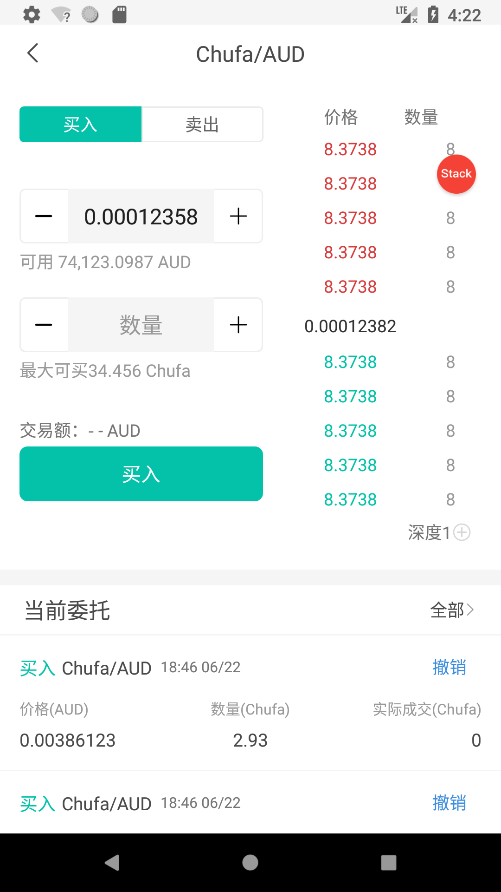
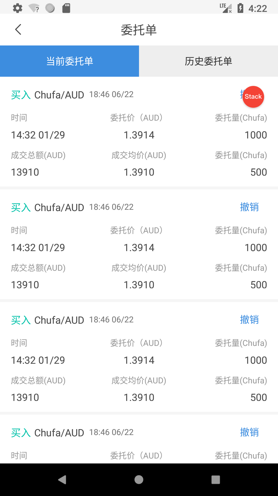
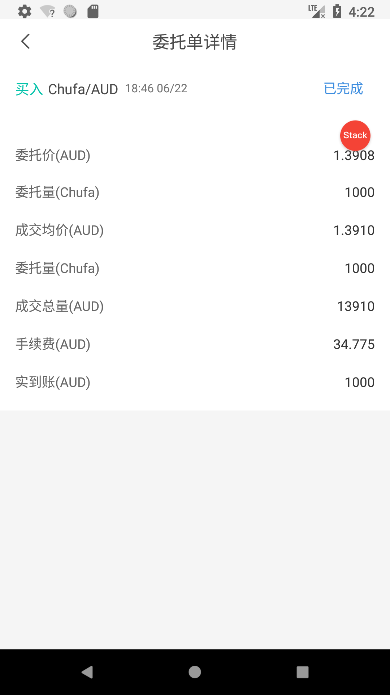
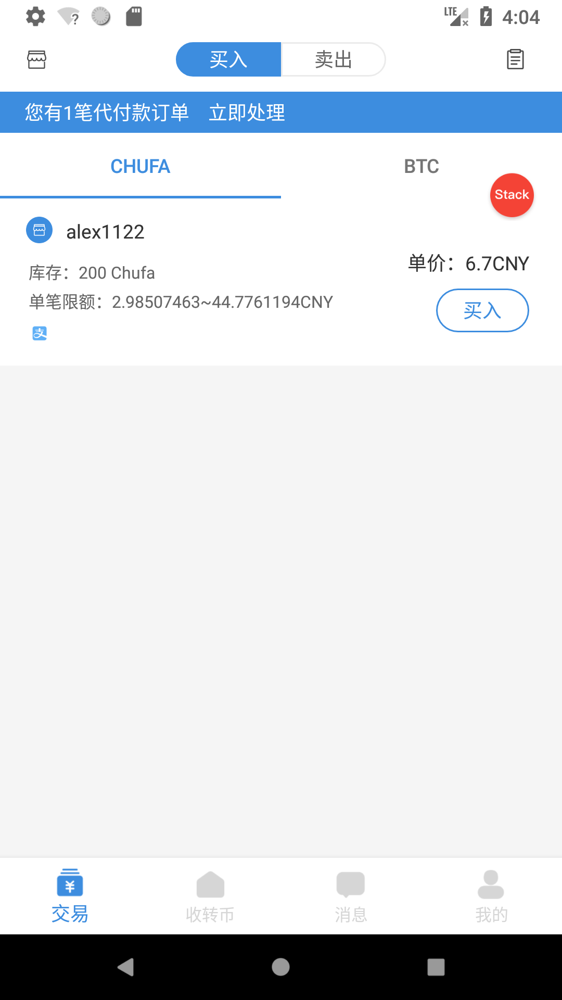
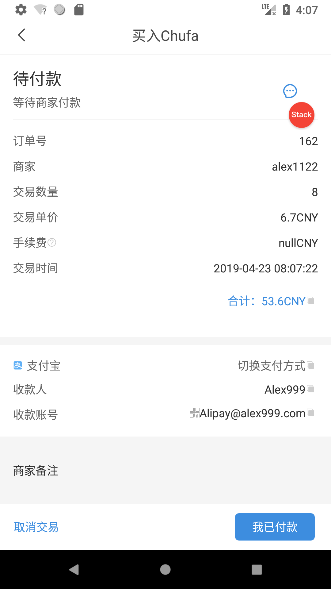
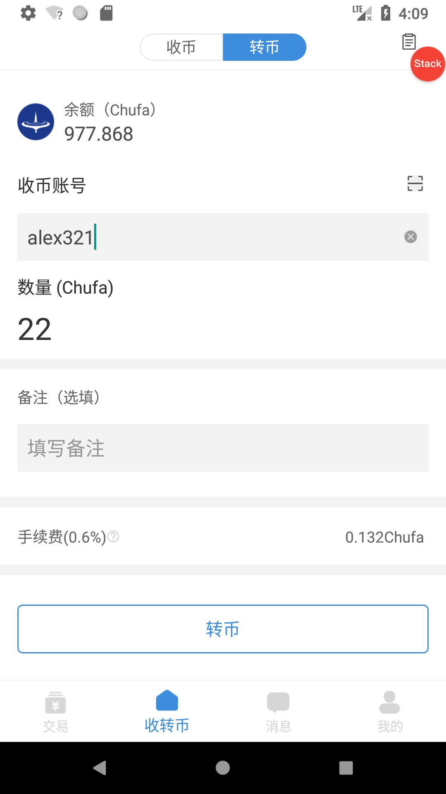
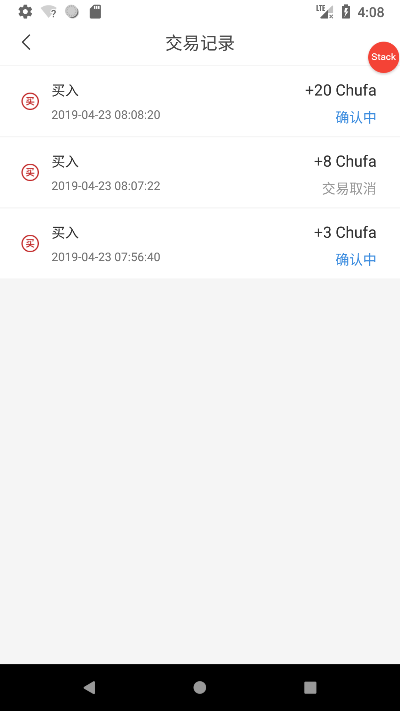
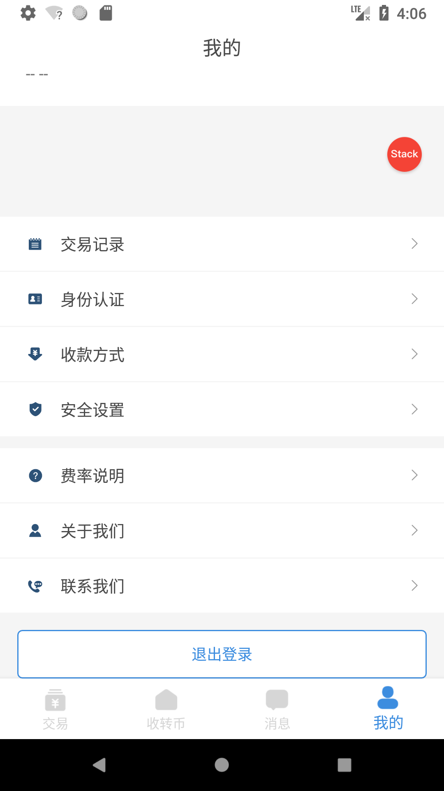
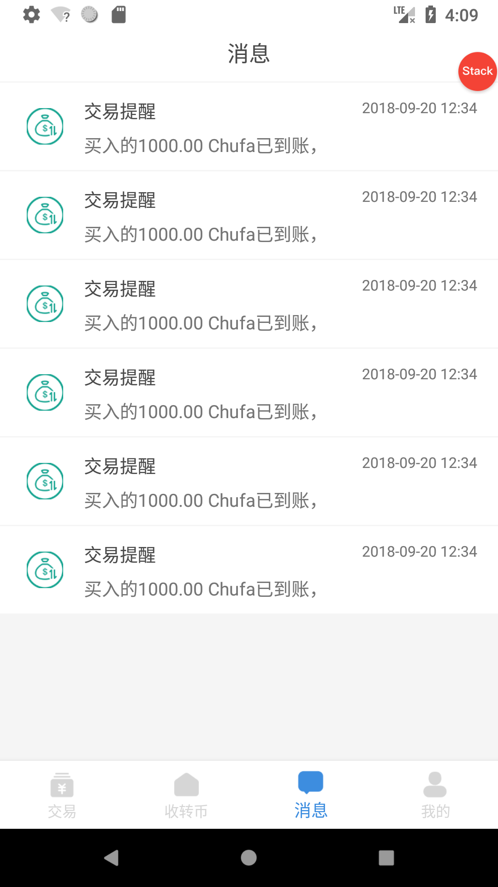
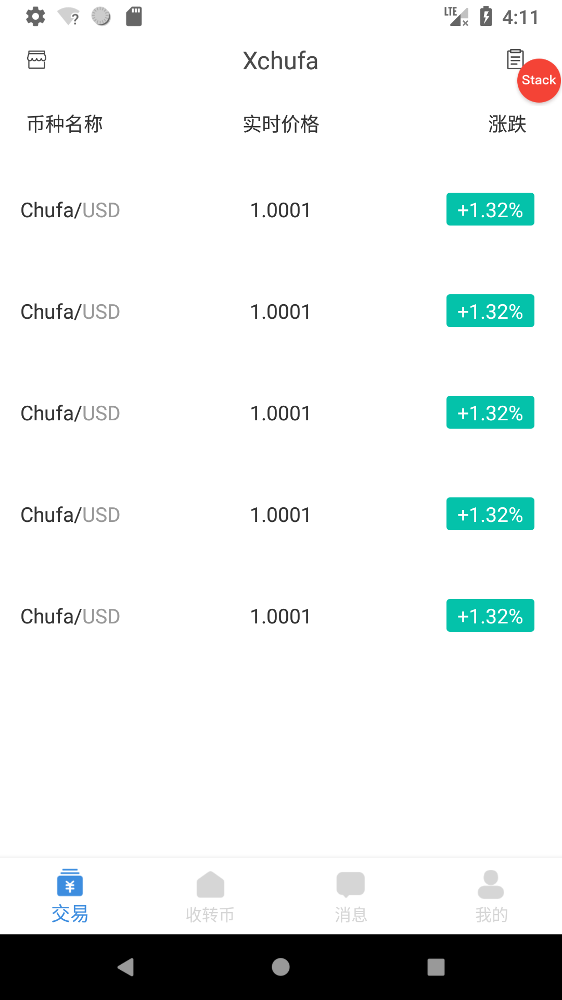

# Beer
Kotlin AAC架构MVVM实现区块链交易所包括撮合、场外交易，UI架子

#### Preview

 

 

 

 

 

#### Points

+ 整个项目采用kotlin语言编写
+ 使用AAC架构模式开发，面向数据编程，数据UI双向绑定，数据改变UI随着改变
+ 使用Fragmentation实现"单Activity＋多Fragment"架构
+ 使用ARouter框架进行模块间通信(页面的跳转以及服务管理)
+ 使用kotlin框架Kotlin-Android-Extensions、Anko
+ 使用注解神器Dagger2
+ 使用Rxjava2进行业务数据处理
+ 使用Glide做图片处理和加载
+ 使用Retrofit2网络请求框架
+ 使用okhttp3对日志、请求内容类型(json)、头部信息进行配置

#### Version

##### V1.0.0

初步实现第一版  如有问题联系微信15622501009  281421465@qq.com
